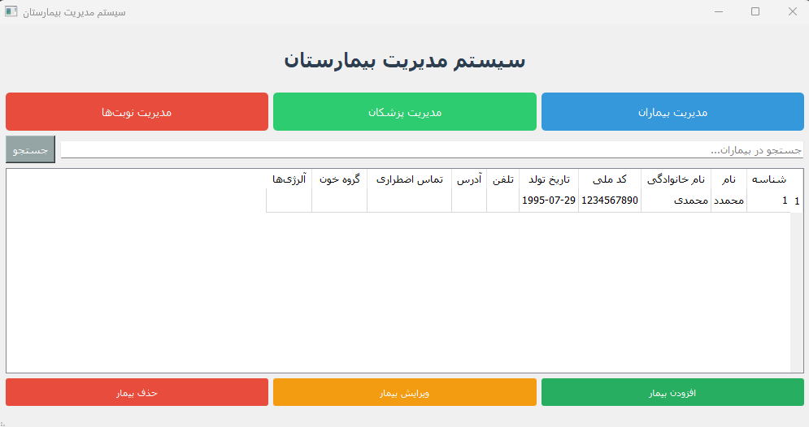

# Hospital Management System

A comprehensive Hospital Management System built with Python and PyQt5, featuring patient management, doctor management, and appointment scheduling with Persian language support.

## Features

- 🏥 **Patient Management**: Add, edit, delete, and search patients
- 👨‍⚕️ **Doctor Management**: Manage doctor information and specialties
- 📅 **Appointment System**: Schedule and manage appointments
- 🔍 **Search Functionality**: Quick search across all modules
- 🌐 **Persian Language Support**: Full RTL layout and Persian interface
- 💾 **SQLite Database**: Lightweight and efficient data storage
- 🎨 **Modern UI**: Clean and professional interface

## Screenshots


*Main application window with patient management*

## Installation

### Prerequisites

- Python 3.7 or higher
- PyQt5

### Setup

1. **Clone the repository:**
   ```bash
   git clone https://github.com/yourusername/hospital-management-system.git
   cd hospital-management-system